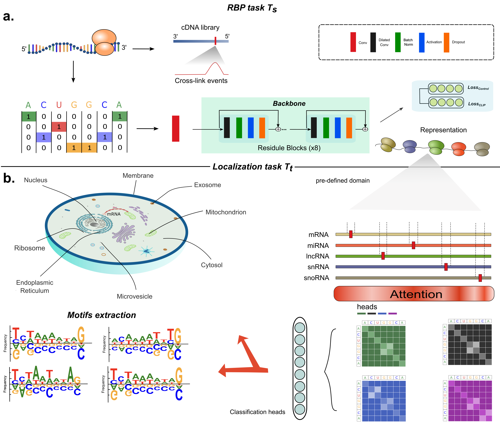

# DeepLocRNA

## Introduction
DeeplocRNA is a deep neural network that predicts the RNA localization, enabling the prediction across 4 RNA types (mRNA, miRNA, lncRNA, snoRNA) and different species (Human and Mouse). 


### Environment preperation

Please make sure anaconda is installed in your local machine, create a new working environment to run DeepLocRNA
```
conda create -n DeepLocRNA python=3.8
```

Enter the new created environment
  
```
source activate deepLocRNA
```


To run the model, you should download DeepLocRNA via git or pypi

<pre>
From git
pip install git+https://github.com/TerminatorJ/DeepLocRNA.git
or from pypi
pip install DeepLocRNA
</pre>


## Train the model
if you want to train the model youself, please follow the following steps

### Step 1: Preparing your FASTA file
#### Input format
DeepLocRNA works on FASTA files, e.g.
<pre>
>test1
ACTGCCGTATCGTAGCTAGCTAGTGATCGTAGCTACGTAGCTAGCTAGCTACGATCGTAGTCAGTCGTAGTACGTCA
>test2
ACACACATGAGCGATGTAGTCGATGATGCATCGACGATCGATCGAGCTACGTAGCATCGATCGATGCATCGACGTAG
</pre>
One can aldo use our prepared dataset to train the model as below

### Step 2: Download this repository to your local machine

<pre>
wget https://github.com/TerminatorJ/DeepLocRNA/archive/refs/heads/main.zip

Then compress the zip file
unzip main.zip
</pre>


### Step 3: Save encoded data

<pre>
cd ./DeepLocRNA
</pre>
  
<pre>
python ./fine_tuning_deeprbploc_allRNA.py --dataset ./data/allRNA/allRNA_all_human_data_seq_mergedm3locall2_deduplicated2_filtermilnc.fasta  
</pre>
Afterwards, there will be "*_X.npy" in the "./DeepLocRNA/data/allRNA/allRNA_all_human_data_seq_mergedm3locall2_deduplicated2_filtermilnc" folder.

In order to do multiple RNA prediction, we will generate tags for all RNA species
<pre>
python ./fine_tuning_deeprbploc_allRNA.py --dataset ./data/allRNA/allRNA_all_human_data_seq_mergedm3locall2_deduplicated2_filtermilnc.fasta --RNA_tag
</pre>
Afterwards, there will be "*_X_tag.npy" in the "./DeepLocRNA/data/allRNA/allRNA_all_human_data_seq_mergedm3locall2_deduplicated2_filtermilnc" folder.

### Step 4: Training the model

We provide two options to train the model

First, you can use standard training strategy, using single GPU (or multiple GPUs) to train the model. It is worth note that the training is entangled with 5-folds as default, which will repeat 5 times to go through the data.

```
python ./fine_tuning_deeprbploc_allRNA.py --dataset ./data/allRNA/allRNA_all_human_data_seq_mergedm3locall2_deduplicated2_filtermilnc.fasta --load_data --gpu_num 1 --species human --batch_size 8 --flatten_tag  --gradient_clip --loss_type BCE  --jobnum 001
```
Alternatively, DDP (data distributed parallel) strategy can be use to use multiple GPUs to train the model locally

```
python ./fine_tuning_deeprbploc_allRNA.py --dataset ./data/allRNA/allRNA_all_human_data_seq_mergedm3locall2_deduplicated2_filtermilnc.fasta --load_data --gpu_num 1 --species human --batch_size 8 --flatten_tag  --gradient_clip --loss_type BCE  --jobnum 001 --DDP
```


## Model Prediction.

There should prepare your input file to ".fasta"(#Input-format) format

```
python ./DeepLocRNA/fine_tuning_deeprbploc_allRNA_prediction.py --fasta ./example.fasta 
```
Alternatively, you can also use our online webserver if you only have a couple sequences to be predicted ()

## IG scores calculation

### attribution config file
```
starts,ends
10,100
50,100
```
Where 10 to 100 is the interval that you want to get the attribution scores.
```
python fine_tuning_deeprbploc_allRNA_prediction.py --fasta ./example.fasta --att_config ./att_config.csv --plot True
```
If you wish to get the precise nucleotide contribution, please choose "--plot" as True, and define the configure file yourself as "att_config.csv" before input in the input frame.


arguments
Long                    |  Description
------------------------|  ------------
`--fasta`               |  Path to the input fasta file, formatted according to [the input format](#input-format).
`--att_config`          |  Path to the customized position of a specific sequence as `.csv`. formatted according to [att config format](#attribution-config-file)
`--plot`                |  Plot the attribution figures, this is mandatory if you want to visualize the explaination plots. Default: True


