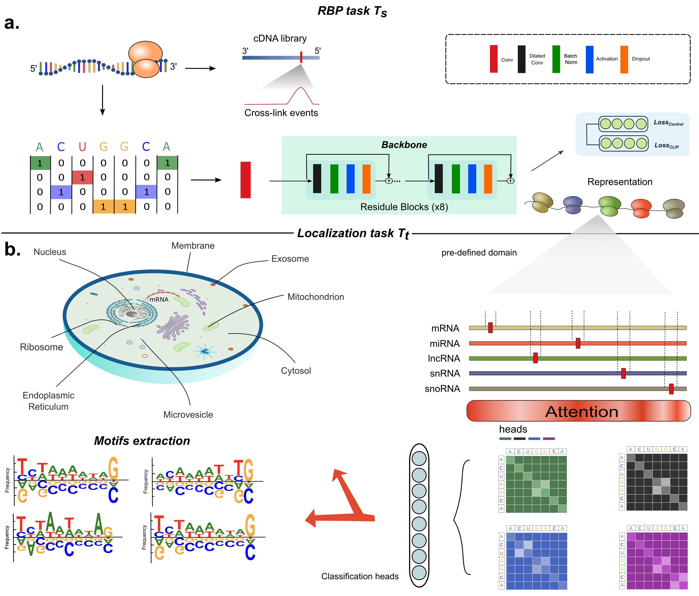

# DeepLocRNA

DeeplocRNA is a deep neural network that predict the RNA localization, enabling the prediction across 5 RNA species (mRNA, miRNA, lncRNA, snRNA, snoRNA) and different species (Human and Mouse).  

If you are also interested in the protein localization, please refer to our protein version:  
https://services.healthtech.dtu.dk/services/DeepLoc-2.0/

In this webserver, we support the input file in a ".fasta" format. Because of the limited computational resource, this webserver only supports up to 200 sequences.  

IG scores can also be calculated to explain the model by following this instruction (https://github.com/TerminatorJ/DeepLocRNA/DeepLocRNA/README.md).   


Alternatively, if you want to predict a large number of RNA sequence, please download our standalone tool by  
```
pip install DeepLocRNA
```

More instructions of the standalone tool can refer to our git repository as: 
https://github.com/TerminatorJ/DeepLocRNA  
# Concept image



